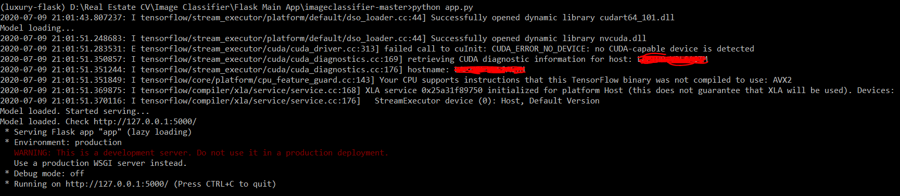

# Hotelify: A classifier for hotel images

## Introduction
Ever booked a hotel online? Which aspect of the hotel listings captures your attention most while scrolling down the pages. Believe it or not, its the images of the hotel (of course after the price :stuck_out_tongue_winking_eye:). Images of the hotels play an important role in determining the choice of the hotel that a user makes.

## Problem Statement
Today, with the advent of the digital era, majority of hotel bookings are conducted online. Hotels send images to hotel listing sites like [Makemytrip](https://www.makemytrip.com/), [Yatra](https://www.yatra.com/), etc. which the customers use to make bookings. However, with rise in number of hotels taking the digital route, hotel listing companies are faced with an important problem. 

### Main issue
Receiving images from thousands of hotels throughout the year, the image dataset of the hotel listing companies spans millions of images. The problem arises when these images have to be segregated manually into different classes like *Exterior*,*Lobby*,*Bedroom*,etc. to provide the user a better viewing experience. With the exponentially growing dataset of images and need for pace and efficiency, a automated solution is essential. 

## Deep Learning provides the solution
Deep convolutional networks have been demonstrated to perform extremely well on image classification tasks due to their ability to learn complex features from the input image pixels. One such company which used deep learning to classify its images is [*Kayak*](https://www.kayak.co.in/hotels). This blog post ([Kayak Medium Blog](https://medium.com/kayak-tech/hotel-image-categorization-with-deep-learning-ffa8429e55b5)) discusses how *Kayak* accomplished this task.

## Gist of my work and results 
I used the *InceptionV3* architecture as the base model for the task of classifying the hotel images. I created other convolutional layers on top of the base model. I trained the model on a [dataset](https://www.dropbox.com/s/utg59on1du4ushp/Dataset.zip?dl=0) comprising of *75000 images divided into 15 classes* which I assemebled by collecting images from various sources. I was able to achieve a categorical accuracy of ~80% and top-3 categorical accuracy of ~95% on the validation set. See results in `model_data_augment_full_train_main.ipynb`. I then deployed the model to a `Flask` app which runs on a local server.

  

## Files included in the repository

### Links

* **Link_to_Dataset.txt** ([Link](https://www.dropbox.com/s/utg59on1du4ushp/Dataset.zip?dl=0))- This file contains the link to the zip file of the dataset I used. The folder contains 2 subfolders named `Train` and  `Val`. Each of these folders contains subdirectories corresponding to the different classes of images.

* **Link_to_test_images.txt** ([Link](https://drive.google.com/file/d/1l7acmfTUXYmk3N47gd7VZQoh6axL9Qzs/view?usp=sharing))- Contains link to the images used for testing and visualisation in `model_data_augment_full_train_visualise.ipynb`.

* **Link_to_trained_model.txt** ([Link](https://drive.google.com/file/d/1y1JQe6MY-5v3NZGtHX1jLhF7oN6SxhZ8/view?usp=sharing))- Contains link to the trained model. Includes all model weights and assets.

### Jupyter Notebooks

* **data_augmentation_visualisation.ipynb**- This file presents the data augmentation parameters and technique used for training the model. The effect of the chosen augmentation techniques have been displayed on a test image.

* **model_data_augment_full_train_main.ipynb**- Main file which includes image data generators, model declaration, compilation and fitting of the model and evaluation of the model.

* **model_data_augment_full_train_visualise.ipynb**- Visualisation file displaying the predictions of the trained model on random test images.

### Flask Main App
This folder contains the necessary files for running the Flask App on a local server. The python file `app.py` needs to be run in order to launch the app. 

### Python files

* **image_data_gen.py**- File containing the image data generator modules  `train_generator` and `val_generator`. Includes the data augmentation parameters used.

* **read_classes.py**- Utility file which return a dictionary mapping the numeric indexing of the classes to their names.

### Text file
* **classes.txt**- Text file containing the names of the classes and their corrresponding numeric indices.

## Usage details

> **Note**: The jupyter files have been written in `google colab`. Datasets and images folders were first uploaded to google drive. The google drive was then mounted on the colab platform and the folders were accessed directly in colab. Considering this, you may have to make changes in the directory paths used in the notebooks based on locations where you have your folders stored.

### Running the App
Navigate into the `Flask_Main_App` folder. In the `app.py` file, make changes to the directory path based on the location of your trained model folder. Run the `app.py` file. The app will be launched on a local server.

  

### Running the model
If you want to simply run the model and test it for new images, please refer to `model_data_augment_full_train_visualise.ipynb`. You will have to use the [Link_to_trained_model.txt](https://drive.google.com/file/d/1y1JQe6MY-5v3NZGtHX1jLhF7oN6SxhZ8/view?usp=sharing) for this purpose.

### Understanding and modifying model architecture
Please refer to `model_data_augment_full_train_main.ipynb`. The dataset is available at [Link_to_Dataset.txt](https://www.dropbox.com/s/utg59on1du4ushp/Dataset.zip?dl=0)

## Detailed explanation of the course of my work

The following steps were involved in the project.
* Data Collection and Cleaning
* Deciding model architecture and parameters
* Training and testing the model
* Deploying the model to a `Flask` app

### Data Collection and Cleaning
I was unable to find a dataset of hotel images categorised into different classes. So I assemebled a dataset by picking images from various sources. Majority of the images are from the [Places](http://places2.csail.mit.edu/explore.html) dataset. Some of the classes like `lobby,spa` etc. were not available in the places dataset. So I collected images for these classes using various search engines using prefixed adjectives like `luxurious, ugly, small, cheap, etc.`  to get a good distribution of the images. Once, the dataset was assembled, I wrote python scripts to remove corrupt image files from the dataset and resized the images to a standard `256*256` pixel size.

### Deciding model architecture and parameters
I mainly referred to the [Kayak blog post](https://www.kayak.co.in/hotels). This blog post ([Kayak Medium Blog](https://medium.com/kayak-tech/hotel-image-categorization-with-deep-learning-ffa8429e55b5). Apart from that, I referred to several Youtube videos and some research papers regarding best practices in Deep Learning.

### Training and testing the model
I trained the model using `Google Colab` GPU's. I continuosly saved the checkpoints to my drive so that I could resume training in case of any interruptions in training.

### Deploying the model to a Flask app
I referred to Github repositories implementing basic `Flask` Apps. I understood the directory strcuture and changed `HTML, CSS and JavaScript` files according to my need.  

## Future Aim
I want to add more features to the Flask App. One of the main ideas I want to implement is a GUI where a hotel listing site can upload hundreds of images together and the model evaluates and presents the images in segregated categories. [Kayak website](https://www.kayak.co.in/hotels) interface is an exaple of this.
